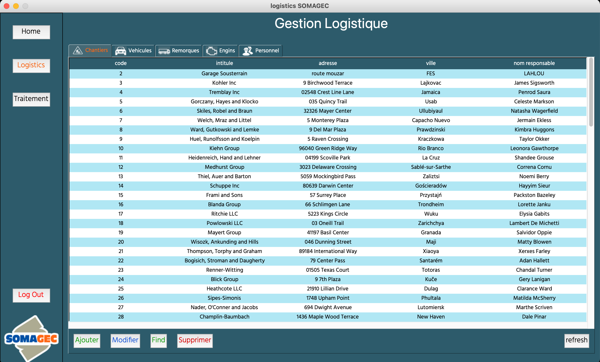

[![MIT License][license-shield]][license-url]
[![LinkedIn][linkedin-shield]][linkedin-url]


<!-- PROJECT LOGO -->
<br />
<p align="center">
  <a href="https://github.com/zakikama/Logistics_SOMAGEC">
    
  </a>

  <h3 align="center">Logistics SOMAGEC</h3>
    Logistics HANDLER
  <p align="center">
    As part of my end of year internship, I was assigned a task to develop a desktop application with the sole purpose of managing the company logistics and browse the database
  </p>
</p>

<details open="open">
  <summary><h2 style="display: inline-block">Table of Contents</h2></summary>
  <ol>
    <li>
      <a href="#about-the-project">About The Project</a>
      <ul>
        <li><a href="#built-with">Built With</a></li>
      </ul>
    </li>
    <li>
      <a href="#getting-started">Getting Started</a>
      <ul>
        <li><a href="#prerequisites">Prerequisites</a></li>
        <li><a href="#installation">Installation</a></li>
      </ul>
    </li>
    <li><a href="#usage">Usage</a></li>
    <li><a href="#roadmap">Roadmap</a></li>
    <li><a href="#contributing">Contributing</a></li>
    <li><a href="#license">License</a></li>
    <li><a href="#contact">Contact</a></li>
    <li><a href="#acknowledgements">Acknowledgements</a></li>
  </ol>
</details>


### Built With

* [PYTHON](python)
* [TKINTER](tkinter)
* [SQLITE](sqlite)


## Getting Started

To get a local copy up and running follow these simple steps.

### Prerequisites

This is an example of how to list things you need to use the software and how to install them.
* npm
  ```sh
  npm install npm@latest -g
  ```
* [Sqlite3](Sqlite3)
* [Tkinter](Tkinter)
* [Tkcalendar](Tkcalendar)
* [PIL](PIL)
* [Bycrypt](Bycrypt)
* [Json](Json)

* [Cryptography](Cryptography)
* [Matplotlib](Matplotlib)
* [Numpy](Numpy)

### Installation

1. Clone the repo
   ```sh
   git clone https://github.com/zakikama/Logistics_SOMAGEC.git
   ```
2. Install NPM packages
   ```sh
   npm install
   ```


<!-- USAGE EXAMPLES -->
## Screenshots





## Contributing

Contributions are what make the open source community such an amazing place to be learn, inspire, and create. Any contributions you make are **greatly appreciated**.

1. Fork the Project
2. Create your Feature Branch (`git checkout -b feature/AmazingFeature`)
3. Commit your Changes (`git commit -m 'Add some AmazingFeature'`)
4. Push to the Branch (`git push origin feature/AmazingFeature`)
5. Open a Pull Request


<!-- LICENSE -->
## License

Distributed under the MIT License. See `LICENSE` for more information.


<!-- CONTACT -->
## Contact

IKAMA Zakaria - [zakaria2ikama@gmail.com](zakaria2ikama@gmail.com) - email

Project Link: [https://github.com/zakikama/Logistics_SOMAGEC](https://github.com/zakikama/Logistics_SOMAGEC)


[contributors-shield]: https://img.shields.io/github/contributors/zakikama/repo.svg?style=for-the-badge
[contributors-url]: https://github.com/zakikama/repo/graphs/contributors
[forks-shield]: https://img.shields.io/github/forks/zakikama/repo.svg?style=for-the-badge
[forks-url]: https://github.com/zakikama/repo/network/members
[stars-shield]: https://img.shields.io/github/stars/zakikama/repo.svg?style=for-the-badge
[stars-url]: https://github.com/zakikama/repo/stargazers
[issues-shield]: https://img.shields.io/github/issues/zakikama/repo.svg?style=for-the-badge
[issues-url]: https://github.com/zakikama/repo/issues
[license-shield]: https://img.shields.io/github/license/zakikama/repo.svg?style=for-the-badge
[license-url]: https://github.com/zakikama/Logistics_SOMAGEC/blob/master/LICENSE
[linkedin-shield]: https://img.shields.io/badge/-LinkedIn-black.svg?style=for-the-badge&logo=linkedin&colorB=555
[linkedin-url]: https://linkedin.com/in/zakaria-ikama-319aa218a
